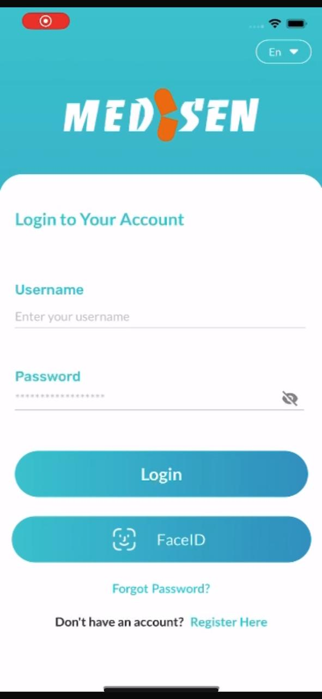
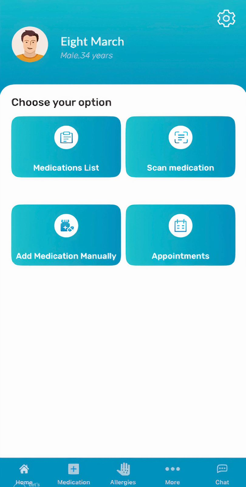
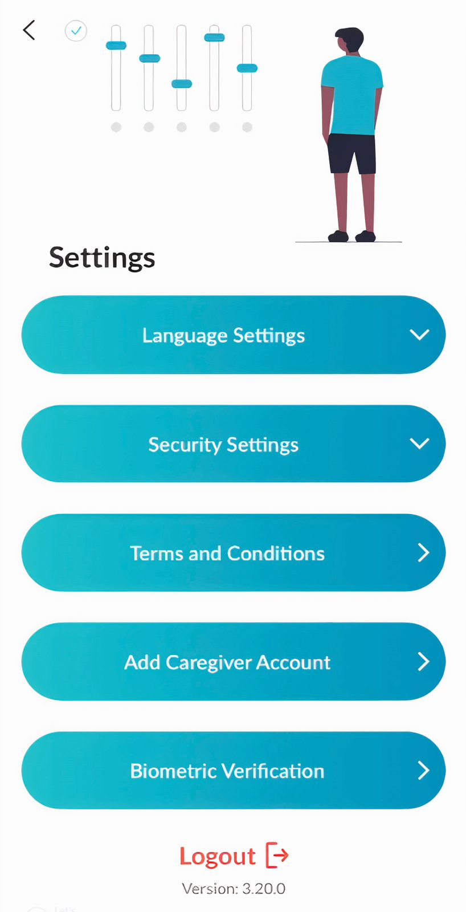
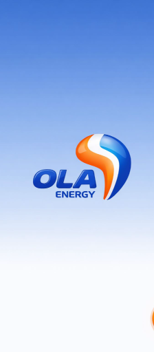
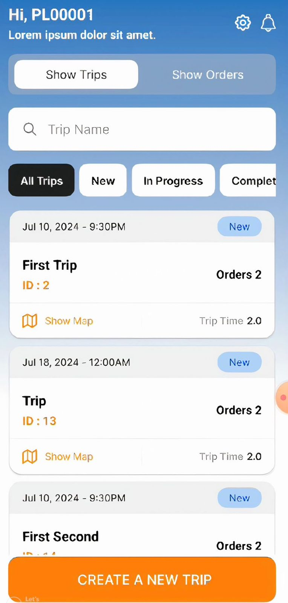
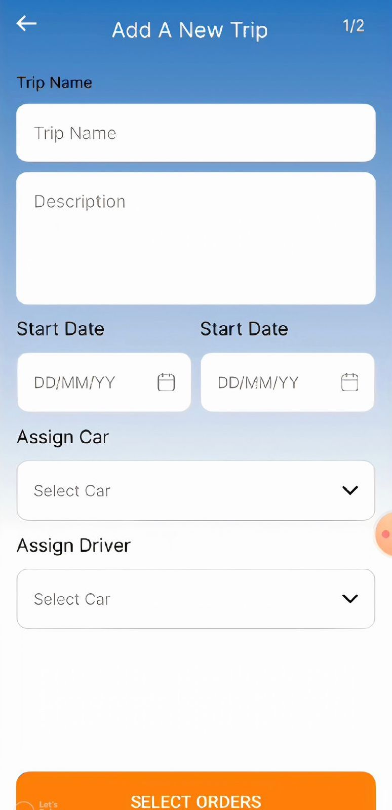
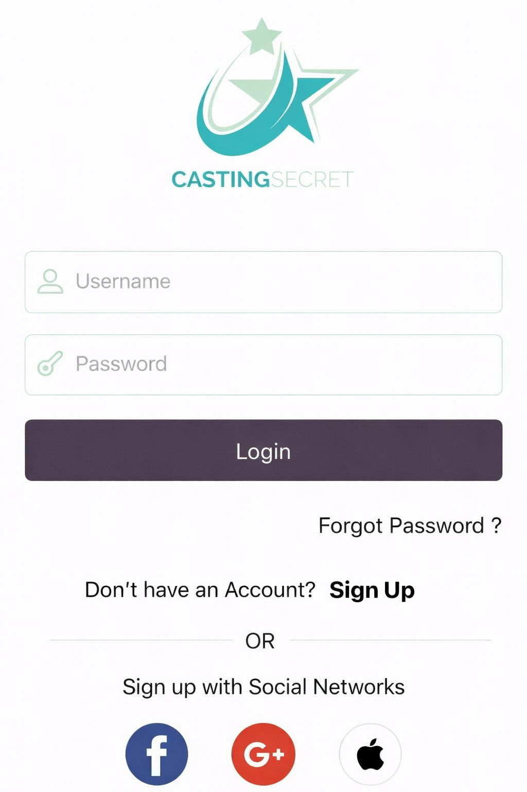
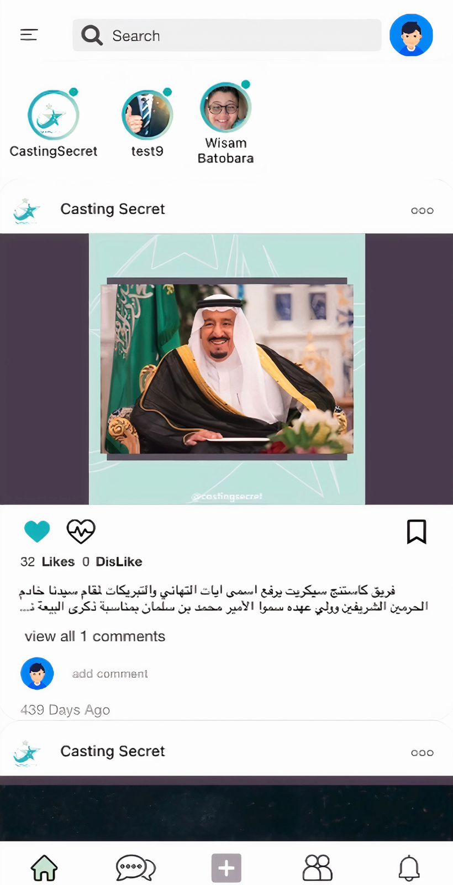
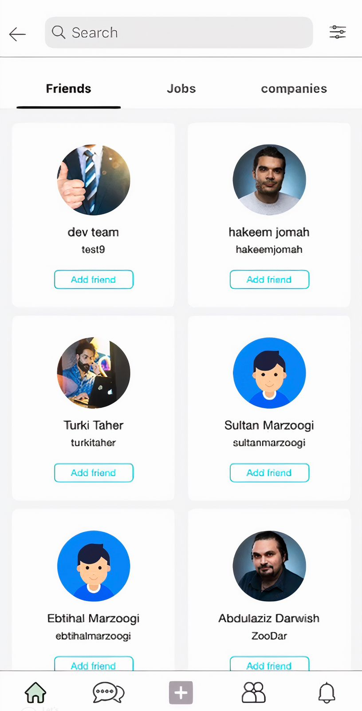

<h1 align="center">💜 Marwa Amer</h1>
<h3 align="center">iOS Developer | Swift | SwiftUI | UIKit</h3>

  
  

---

## 🌸 About Me
Hi, I'm **Marwa Amer**, an **iOS Developer** with over 4 years of experience building user-friendly mobile apps using **Swift**, **UIKit**, and **SwiftUI**.  
I love creating elegant, high-performance apps that make people’s lives easier 💡

---

## 🚀 Featured Projects

### 💊 Drug GPS  
A personal health management app that helps patients organize medication schedules and doctor appointments.  
Includes reminders, chat with doctors, and detailed medical history tracking.  

🧩 **Tech Stack:** Swift, SwiftUI, MVVM, Core Data, Local Notifications  

  
  
  

---

### ⛽️ OLA Energy App  
An app designed for managing trips, cars, and drivers for OLA Energy’s logistics operations.  
Users can view and create trips, assign drivers, and track trip progress in real time.  

🧩 **Tech Stack:** Swift, UIKit, MVVM, Core Data, REST APIs  

  
  
  

---

### 🎭 Casting App  
A social platform for discovering and sharing talents — similar to Instagram but focused on creative users.  
Users can post photos/videos of their talents, follow others, and interact with likes and comments.  

🧩 **Tech Stack:** Swift, UIKit, MVC, REST APIs  

  
  
  

---

## 🧠 Tech Stack

  
  
  
  
  
  
  

---

💜 Designed with passion by <b>Marwa Amer</b>

